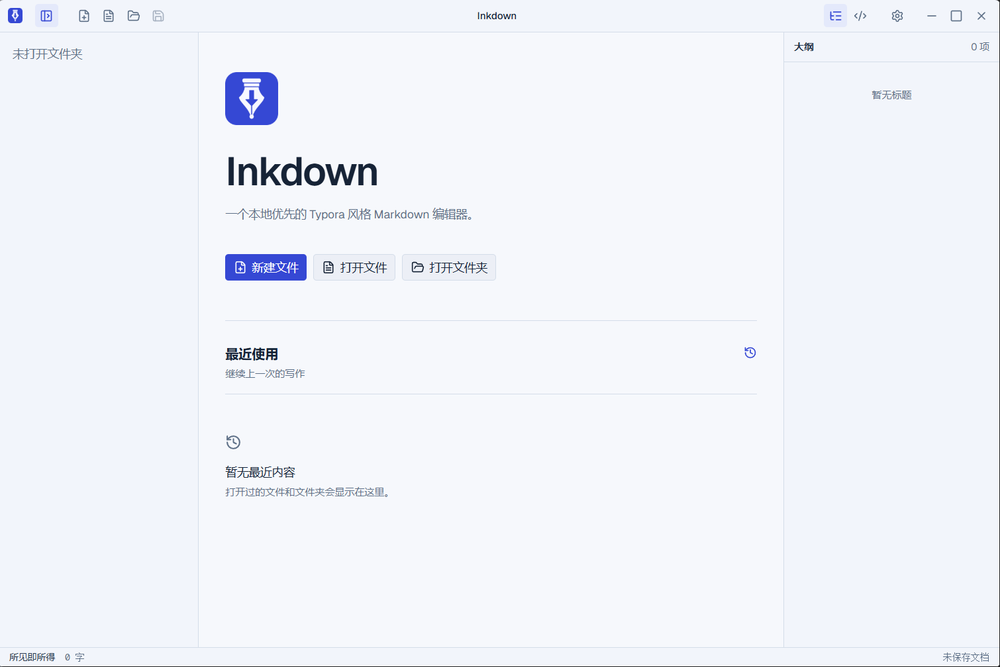

<div align="center">
  
  <h1>Inkdown</h1>
  <p>一个本地优先的 Typora 风格 Markdown 编辑器。</p>
</div>

Inkdown 是一款基于 Electron 和 React 构建的桌面 Markdown 编辑器。它直接读写本地 Markdown 文件，提供所见即所得与源码两种编辑模式，并支持以文件夹作为工作区管理文档。



## 功能特性

- 所见即所得与 Markdown 源码编辑模式
- 多标签页编辑、文件夹工作区、文件树与文档大纲
- 新建、重命名、移动到回收站及在文件管理器中显示文件
- 明亮与暗色主题
- 支持粘贴或拖入图片，并可选择文档相对目录、全局本地目录或 GitHub 图床
- 支持系统代理、直连和手动代理配置
- 记录最近打开的文件与文件夹
- 检查并提示应用更新
- 支持 `.md` 和 `.markdown` 文件关联

## 下载安装

请前往 [GitHub Releases](https://github.com/lzt-T/inkdown/releases) 下载对应平台的安装包。

| 平台 | 架构 | 安装包 |
| --- | --- | --- |
| Windows | x64 | NSIS 安装程序（`.exe`） |
| macOS | x64、arm64 | `.dmg` 或 `.zip` |
| Linux | x64 | AppImage |

## 基本使用

1. 启动 Inkdown 后，选择“新建文件”“打开文件”或“打开文件夹”。
2. 打开文件夹后，可通过左侧文件树浏览和管理 Markdown 文档。
3. 使用标题栏按钮或快捷键切换文件树、大纲、源码模式和主题。
4. 将图片粘贴或拖入编辑器；图片存储位置可在设置中配置。
5. 使用保存命令将内容写回本地文件。Inkdown 会保留原文件的换行符和 UTF-8 BOM 设置。

## 常用快捷键

在 macOS 上，请使用 `Command` 替代 `Ctrl`。

| 操作 | 快捷键 |
| --- | --- |
| 新建文件 | `Ctrl + N` |
| 打开文件 | `Ctrl + O` |
| 打开文件夹 | `Ctrl + Shift + O` |
| 保存 | `Ctrl + S` |
| 另存为 | `Ctrl + Shift + S` |
| 关闭标签页 | `Ctrl + W` |
| 切换文件树 | `Ctrl + B` |
| 切换大纲 | `Ctrl + Shift + E` |
| 切换源码模式 | `Ctrl + /` |
| 切换主题 | `Ctrl + Shift + T` |

## 本地开发

### 环境要求

- [Node.js](https://nodejs.org/) `>= 20.19.0`
- [pnpm](https://pnpm.io/) `10.24.0`

### 安装与启动

```bash
pnpm install
pnpm dev
```

### 检查与构建

```bash
# TypeScript 类型检查
pnpm typecheck

# 类型检查并构建应用
pnpm build

# 构建未打包的应用目录
pnpm build:unpack
```

### 构建平台安装包

```bash
pnpm build:win
pnpm build:mac
pnpm build:linux
```

建议在对应操作系统上构建该平台的安装包。

## 技术栈

- [Electron](https://www.electronjs.org/) 与 [electron-vite](https://electron-vite.org/)
- [React](https://react.dev/) 与 [TypeScript](https://www.typescriptlang.org/)
- [Milkdown](https://milkdown.dev/) 所见即所得编辑器
- [CodeMirror](https://codemirror.net/) 源码编辑器
- [Tailwind CSS](https://tailwindcss.com/) 与 Radix UI
- [Zustand](https://zustand.docs.pmnd.rs/) 状态管理

## 项目结构

```text
inkdown/
├─ src/
│  ├─ main/       # Electron 主进程、文件系统与更新逻辑
│  ├─ preload/    # 安全的渲染进程 API
│  ├─ renderer/   # React 界面与编辑器
│  └─ shared/     # 进程间共享类型与协议
├─ resources/     # 应用运行时资源
├─ build/         # 安装包图标与构建资源
└─ .github/       # GitHub Actions 发布流程
```

## 参与贡献

欢迎通过 [Issues](https://github.com/lzt-T/inkdown/issues) 报告问题或提出建议，也欢迎提交 Pull Request。提交修改前，请确保变更范围清晰，并保持实现简洁。
